# SinalSeguro App


App mobile Android e iOS do SinalSeguro.

Status: MVP tecnico controlado Android-first com Home SOS, Cofre, Player, midia local criptografada em chunks, cliente API real, sessao segura, login Google/Apple preparado, perfis/papeis, anjos/convites API-backed com vinculo visivel para originador e anjo, primeira fatia de SOS roteado para anjos pela EC2, e release privado Android publicado no portal. iPhone/iOS fica pos-MVP.
Coordenacao geral: Ze.  
Gerente AI mobile: Cristine.

## Objetivo

Criar um app gratuito para pessoas em situacao de vulnerabilidade, com rede de anjos, pre-convite local, botao de panico in-app, alerta discreto, localizacao pontual consentida e cofre local. A integracao API-first ja existe para homologacao controlada via `https://api.sinalseguro.com.br/api`; dados reais sensiveis, midia remota, videochamada, localizacao ao vivo e conveniados seguem bloqueados ate contrato, chaves, auditoria, RIPD/DPIA, retencao e revisao juridica/seguranca.

O app nao substitui 190, 180, delegacias, saude, assistencia social, Defensoria, Ministerio Publico, Judiciario ou qualquer servico oficial.

## Stack

- React Native com Expo Dev Client/EAS.
- TypeScript.
- Expo Router.
- Android 7+.
- iOS 15.1+.
- Design system unico para Android e iOS.

## Estado real app/backend - 2026-05-07

Referencia canonica do projeto: `../../../docs/tecnico/ESTADO_ATUAL_APP_BACKEND_2026-05-07.md`.

- API publica validada: `health=ok` e readiness `database=ok`.
- Cliente API real com fachada publica em `src/services/apiClient.ts` e modulos por dominio em `src/services/api/`, com base padrao `https://api.sinalseguro.com.br/api`.
- Login por e-mail, Google OIDC e Apple Sign-In estao preparados no app/API; Apple fica condicionado por env e capability.
- Android privado corrige redirect OAuth nativo com schemes `sinalseguro` e `br.com.sinalseguro.app`.
- Bloqueio atual: habilitar `Custom URI scheme` no OAuth Android privado do Google Cloud e repetir login fisico para validar `/auth/google`, JWT, `auth/me`, `/devices/` e logout.
- Gates desta atualizacao documental: `npm run typecheck`, `npm run lint` e `npm test` aprovados.

## Metodo de engenharia com IA

O desenvolvimento do app usa **Spec-Driven AI Development com memoria documental local**.

Isso significa que a IA apoia engenharia de requisitos, especificacao, implementacao, revisao e testes a partir dos documentos do repositorio. A memoria funciona em abordagem RAG-like: antes de gerar codigo ou documentacao, o contexto e recuperado de `AGENTS.md`, `.codex/AGENTS.md`, `.codex/memory/CRISTINE.md`, `docs/03_TIMELINE.md` e das especificacoes em `docs/`.

Essa tecnica complementa a engenharia tradicional: stack, arquitetura, contrato de API, seguranca, LGPD, testes e criterios de aceite continuam documentados e validados. Mudancas tecnicas passam por Schneier e Myers; mudancas visuais passam por Norman, Tarcila e Myers.

## Comandos

Use Node 22.13+ para evitar incompatibilidade com Metro/React Native.

```bash
npm install
npm run assets:qr
npm run release:android:readiness
npm run typecheck
npm run lint
npm test
npm run test:live-call-session
npm run test:live-call-state
npm run test:live-webrtc
npm run test:live-call-security
npm run test:api-client
npm run build:android:debug:bundled
npm run start
```

Builds internos serao feitos por EAS ou build local controlado quando Kim liberar as credenciais e perfis fora do repositorio.

Atalhos da Etapa 1 Android:

```bash
npm run doctor
npm run build:android:preview
npm run build:android:production
```

## Instalacao e QR codes

Os QR codes apontam para paginas publicas estaveis. O release privado Android atual e publicado no portal SinalSeguro/EC2; lojas oficiais entram em etapa posterior.

| Plataforma | QR | URL |
|---|---|---|
| Android |  | `https://www.sinalseguro.com.br/baixar/android` |
| iPhone | pagina sem QR ativo | `https://www.sinalseguro.com.br/baixar/ios` |

Status atual:

- Android privado: publicado no portal em `https://www.sinalseguro.com.br/downloads/private/android/sinalseguro_android.apk`.
- Versao/data exibida no portal: `0.1.13` em `17/05/2026`.
- SHA-256 Android privado: `7b9c6f110313ade8b4740200edbf77cdbe0e92b5654ecd5aaf42a8d8f08e8bae`.
- Manifesto publico: `https://www.sinalseguro.com.br/downloads/installers.json`.
- iPhone: sem release ativo; sera disponibilizado posteriormente.
- GitHub: nao versionar APK/AAB/IPA privados. O APK privado deve ser publicado somente no portal/EC2, com checksum, QR e manifesto versionados.
- UX publica do portal: telas de download sem termos internos como frentes, release, EC2, manifesto ou checksum; fluxo em ate tres interacoes; QR Android e nome `sinalseguro_android.apk` permanecem estaveis nas proximas atualizacoes.

Release Android legado em GitHub Releases:

- Tag: `android-v0.1.0-internal.2`.
- APK: `https://github.com/sinalseguro/App/releases/latest/download/sinalseguro-android.apk`.
- SHA-256: `dbad294407038cac954fd3154bac6c4ea9dbb30b4e79164f58807e83f0d358cb`.

Checkpoint tecnico atual:

- Splash nativa substituida por lockup aprovado com simbolo grande, nome e fundo institucional `#120A20`.
- Home principal fixa, sem rolagem, com foco no SOS central responsivo e atalhos oficiais `Policia 190`, `Bombeiros 193` e `SAMU 192`.
- Menu retratil por engrenagem com acoes objetivas: `Cofre`, `Anjos`, `Player` e `Configuracoes`; toque fora fecha o menu.
- `Modo atual` abre modal de ajuda/opcoes dentro da identidade visual.
- Todos os alertas criticos de Home e Cofre usam modal SinalSeguro, nao `Alert.alert` nativo.
- Cofre local foi refatorado para tela fixa por icones: Player, Cofre, Funcionamento e Atualizar.
- O modal do Cofre usa grade vertical de pacotes locais; cada pacote abre acoes em linhas/colunas para visualizar, compartilhar interno futuro, excluir ou finalizar quando ativo.
- Configuracoes ficam em tela iconografica sem banner/status tecnico no topo.
- Player e trilha do cofre abrem em modais.
- Encerramento de chamado ativo pelo Cofre segue o mesmo protocolo da Home: confirmacao e codigo local opcional quando ativado.
- Modais possuem rolagem interna para reduzir risco de overflow em Android menor ou fonte ampliada.
- Componentes da Home separados em `src/features/emergency-home/` para manter evolucao modular e revisao por Tarcila, Norman, Ada, Hedy, Schneier e Myers.
- Chamado ativo tem regra singleton no servico, evitando dois pacotes `recording_local` simultaneos.
- Exclusao de pacote local exige confirmacao e fica bloqueada enquanto o chamado estiver ativo.
- Simulador web usa memoria volatil, nao cofre real.
- Convite de anjo nasce somente no backend, com link unico e aceite bloqueado quando o servidor nao reconhece o token.
- Pacote local de emergencia com horario, consentimento, georreferencia pontual autorizada, hash e video/audio local quando a usuaria conceder camera e microfone no build privado.
- Area `Cofre local` para acessar pacotes e videos preservados neste dispositivo e verificar o que permanece bloqueado ate backend, contrato, chaves e auditoria.
- Build privado Android habilita `CAMERA` e `RECORD_AUDIO` para homologacao controlada. O SOS ao vivo com anjo autorizado usa WebRTC P2P apos controle pela EC2/API; compartilhamento externo, conveniados e envio remoto de midia bruta continuam bloqueados.

Arquitetura atual do cliente API:

- `src/services/apiClient.ts` preserva `apiClient`, `SinalSeguroApiClient`, `ApiRequestError`, `apiConfig`, `getHealth` e os tipos consumidos pelo app.
- `src/services/api/contracts.ts` concentra schemas Zod, tipos e inputs.
- `src/services/api/core.ts` concentra request comum, refresh, tratamento de erro saneado e contrato de sessao injetavel.
- `src/services/api/sessionStore.ts` mantem a sessao real no `SecureStore`.
- `src/services/api/authClient.ts`, `devicesClient.ts`, `profilesClient.ts`, `contactsClient.ts`, `emergencyClient.ts` e `releasesClient.ts` separam os endpoints por recurso.
- Mudancas futuras devem manter a fachada compativel ate existir uma etapa propria para migrar consumidores.
- `npm run test:api-client` cobre sessao corrompida, refresh, logout, login Google, update publico e chamadas P2P/envelope autenticadas.

Arquitetura atual da chamada ao vivo:

- `src/features/live-call/useLiveAudioCall.ts` orquestra WebRTC, polling de sinais, estado da chamada e marcadores de auditoria.
- `src/features/live-call/liveCallSessionPolicy.ts` concentra regras puras de payload SDP/ICE, papel da chamada, auditoria por papel e renderizacao do stream remoto.
- `src/features/live-call/liveCallStatePolicy.ts` concentra estado inicial, chamada ativa, mensagens e transicoes previsiveis do ciclo owner/anjo.
- `src/features/live-call/liveWebRtcPolicy.ts` concentra constraints de midia, timeout, normalizacao de modos, estado ICE/conexao e selecao de stream remoto.
- `npm run test:live-call-session`, `npm run test:live-call-state`, `npm run test:live-webrtc` e `npm run test:live-call-security` cobrem essas regras sem abrir camera, WebRTC real, API, UI ou backend.

Arquitetura atual da Home/SOS:

- `app/index.tsx` continua como orquestrador da Home, camera, SOS local, sincronizacao remota e chamada ao vivo.
- `src/features/emergency-home/panicTriggerPolicy.ts` concentra regras puras do botao SOS: duplo acionamento, midia pendente, encerramento, consentimento e inicio do chamado.
- `src/features/emergency-home/remoteSyncStatusPolicy.ts` concentra mensagens e decisao visual da sincronizacao remota do SOS ativo.
- `src/features/emergency-home/ownerAutoCallPolicy.ts` concentra a decisao de autochamada do solicitante apos aceite do anjo.
- `src/features/emergency-home/ownerLiveEvidencePolicy.ts` concentra a decisao de iniciar a evidencia local da chamada ao vivo no aparelho solicitante.
- `src/features/emergency-home/mediaHandoffPolicy.ts` concentra a decisao de preparar ou bloquear a entrega de camera/microfone locais para chamada ao vivo.
- `src/features/emergency-home/mediaProcessingStatusPolicy.ts` concentra mensagens e progresso visual do processamento de midia no encerramento e no handoff para chamada ao vivo.
- `src/features/emergency-home/finishOutcomePolicy.ts` concentra o resultado final do encerramento do SOS: evidencia protegida, pendente, somente metadados ou falha saneada.
- `npm run test:panic-trigger`, `npm run test:remote-sync-status`, `npm run test:owner-auto-call`, `npm run test:owner-live-evidence`, `npm run test:media-handoff`, `npm run test:media-processing-status` e `npm run test:finish-outcome` cobrem essas decisoes sem abrir camera, WebRTC real, API, UI ou backend.

APK privado Android atual para validacao fisica, portal e atualizacao pelo app:

- Caminho local estavel: `distribution/android/out/sinalseguro-android.apk`.
- URL publicada: `https://www.sinalseguro.com.br/downloads/private/android/sinalseguro_android.apk`.
- Link direto versionado: `https://www.sinalseguro.com.br/downloads/private/android/sinalseguro_android.apk?v=0.1.15-20260518T112447Z`.
- Versao publicada: `0.1.15` / `versionCode 17`.
- SHA-256: `b4f58d1d322a890da5dab0e717d0c81ceb4fb897fb91ef96ae34522b2e1c664c`.
- Build local para o device fisico conectado: `./gradlew assembleDebug -PsinalBundleDebugJs=true -PreactNativeArchitectures=arm64-v8a`.
- Observacao: este APK privado e artefato de homologacao Android, nao release de loja e nao deve ser versionado no Git.
- O APK debug atual embute o bundle JS e desliga o suporte nativo de desenvolvedor apenas neste modo de validacao, abrindo sem Metro, sem `adb reverse` e sem depender de `localhost:8081`.
- O gate publico `npm run release:android:readiness` fica bloqueado enquanto este workspace contiver a instrumentacao privada de midia (`expo-camera`/`expo-video`). Para loja/publico, usar perfil ou branch sem midia local ate a liberacao juridica.
- Validacao Android mais recente confirmou que `br.com.sinalseguro.app:/oauthredirect`, `sinalseguro:/oauthredirect` e `sinalseguro://configuracoes` resolvem para o app.
- Login Google real ainda depende de habilitar `Custom URI scheme` no OAuth Android privado do Google Cloud.
- Convites por link publico usam `https://www.sinalseguro.com.br/convite#convite=<codigo>`; o app preserva convite pendente de forma cifrada durante login, consentimentos e permissoes antes do aceite.
- A tela `Anjos de confianca` mostra `Anjos` para quem o usuario autorizou e `Sou anjo` para quem convidou o usuario; o aceite deve exibir `Voce e anjo de ...` sem expor token, telefone, e-mail bruto, midia ou localizacao.
- A versao `0.1.5` bloqueia convites locais/antigos: se o link nao existir no backend, a tela mostra `Convite indisponivel`, `Aceite bloqueado` e desativa `Aceitar como anjo`.
- Testes fisicos manuais da `0.1.5` aprovados por Roberto em 2026-05-16; a `0.1.7` corrigiu a clareza visual da versao instalada e manteve a tela Android de alertas recebidos para teste manual pelo portal.
- A versao `0.1.13` sincroniza ocorrencia SOS com `/api/emergency-sessions/`, roteia apenas para anjos aceitos com dispositivo ativo/chave publica, permite que o anjo autorizado acompanhe video/audio ao vivo em WebRTC P2P, preserva video local cifrado da chamada no aparelho do solicitante e finaliza a sessao remota antes de tratar o fluxo como concluido.
- Localizacao ao vivo, conveniados e compartilhamento externo de midia continuam bloqueados ate frentes proprias e revisao juridica/seguranca.

## OIDC Google

O app esta preparado para login Google via `expo-auth-session` e troca do ID token no backend SinalSeguro por JWT interno.

Variaveis publicas do app:

- `EXPO_PUBLIC_GOOGLE_OIDC_ANDROID_CLIENT_ID`
- `EXPO_PUBLIC_GOOGLE_OIDC_WEB_CLIENT_ID`
- `EXPO_PUBLIC_GOOGLE_OIDC_IOS_CLIENT_ID`

Variavel segura do backend, sempre fora do Git:

- `GOOGLE_OIDC_CLIENT_IDS`

Configuracao Android para o client OAuth:

- Package name: `br.com.sinalseguro.app`
- SHA-1 local do APK debug privado atual: `5E:8F:16:06:2E:A3:CD:2C:4A:0D:54:78:76:BA:A6:F3:8C:AB:F6:25`

Para esta fase, usar primeiro o client OAuth **Android**. O valor gerado deve ser colocado em `EXPO_PUBLIC_GOOGLE_OIDC_ANDROID_CLIENT_ID` no ambiente de build do app e tambem em `GOOGLE_OIDC_CLIENT_IDS` no backend, separado por virgula caso existam outros clients futuros.

Regras:

- Nao usar client secret no app.
- Nao reutilizar client OAuth do CereusIA; o SinalSeguro deve manter audiencia propria e isolada.
- Backend aceita apenas audiencias listadas em `GOOGLE_OIDC_CLIENT_IDS`.
- Google/iCloud ficam bloqueados visualmente quando o client ID da plataforma atual nao estiver configurado.

## Evidencias visuais

| Tela | Print |
|---|---|
| Home SOS | 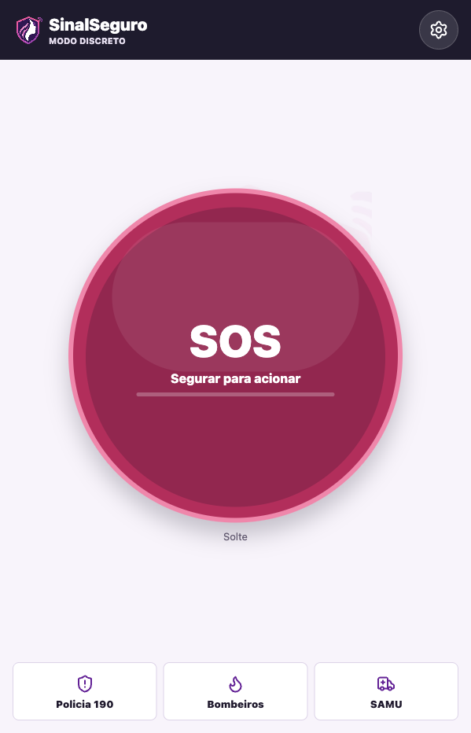 |
| Menu da Home | 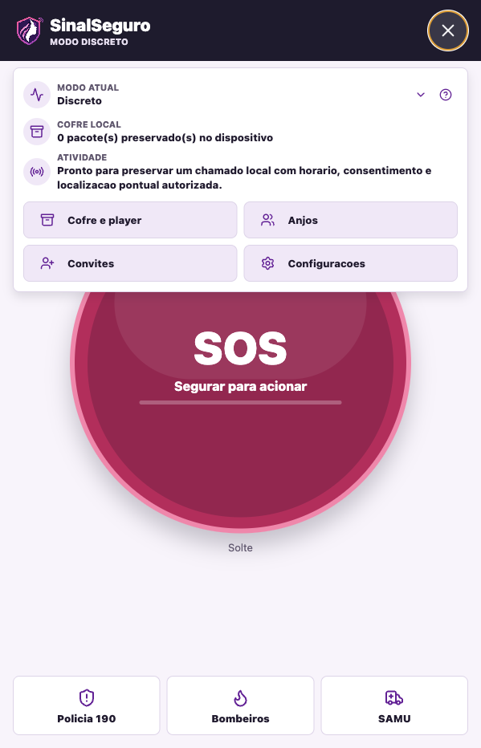 |
| Cofre fixo | 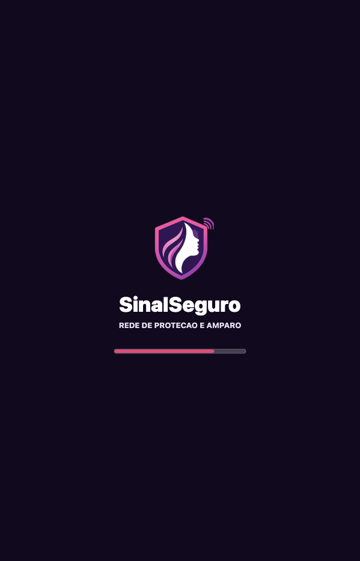 |
| Player modal | 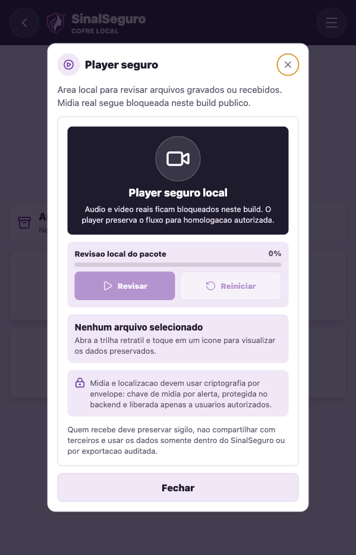 |
| Como funciona | 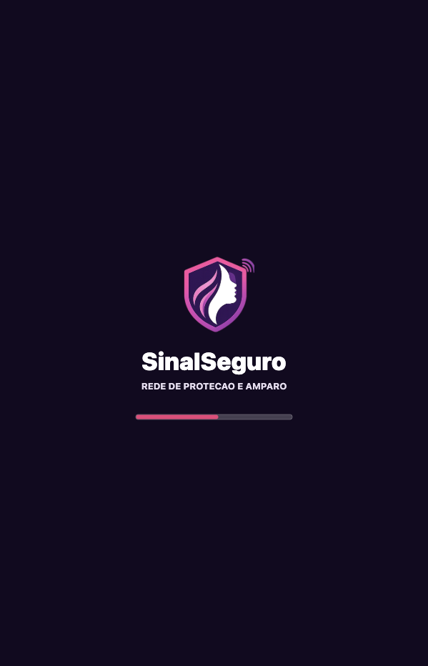 |
| Home SOS bolha | 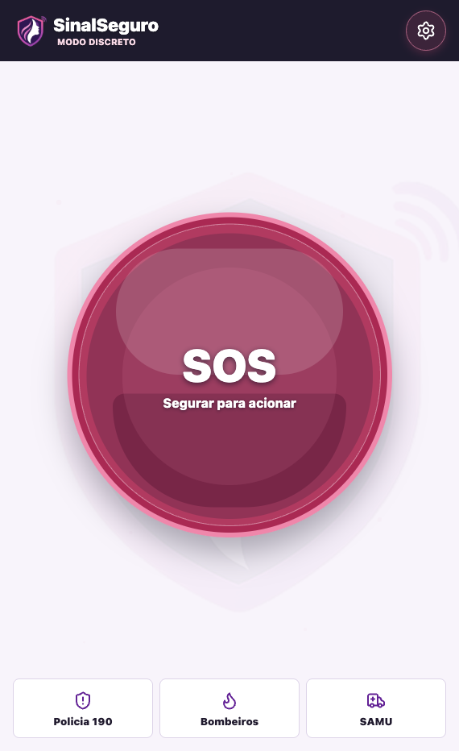 |
| Menu Cofre/Player | 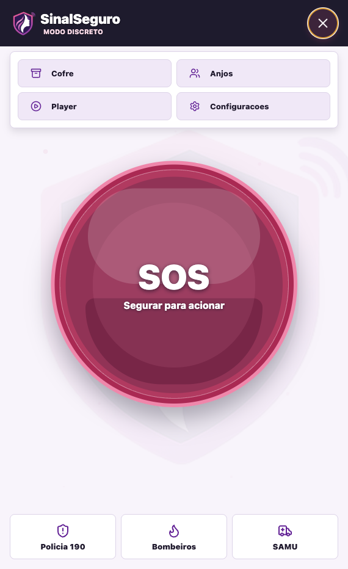 |
| Configuracoes sem banner | 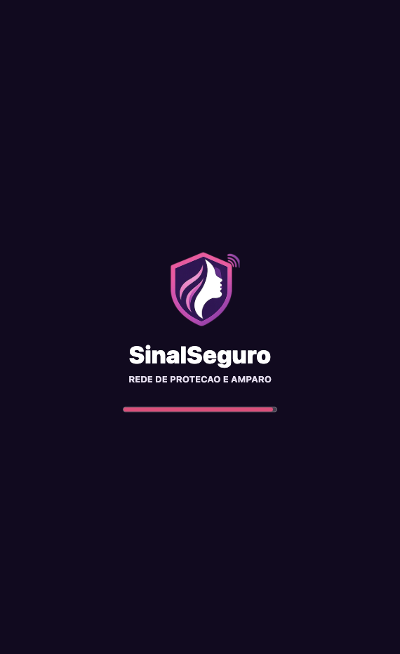 |
| Cofre modal em grade | 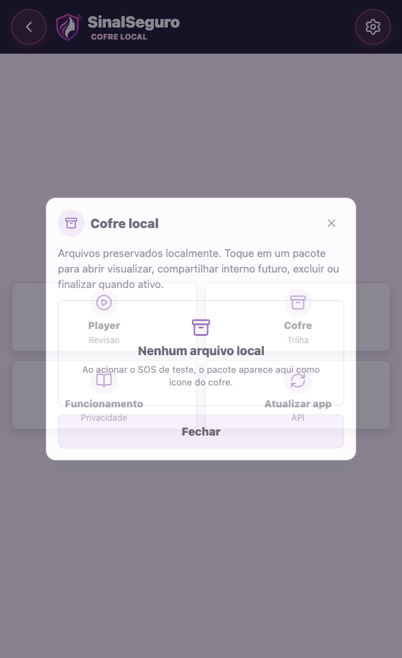 |

## Evidencias Android fisico - 2026-05-03

| Validacao | Print |
|---|---|
| Home sem Metro/sem reverse | 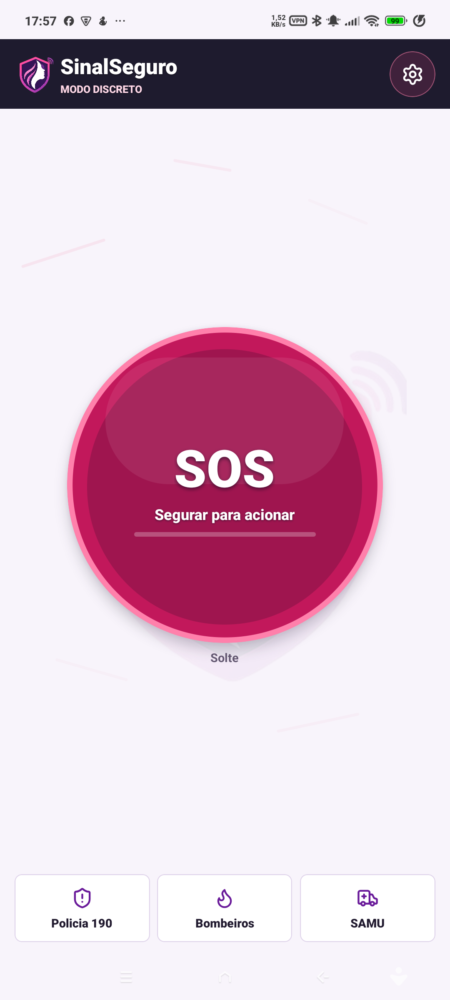 |
| Configuracoes por icones | 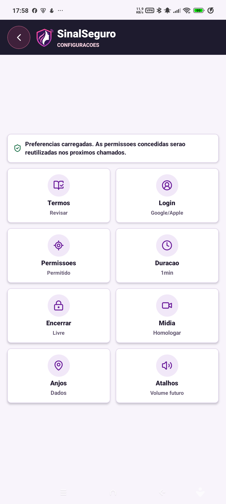 |
| Cofre por icones | 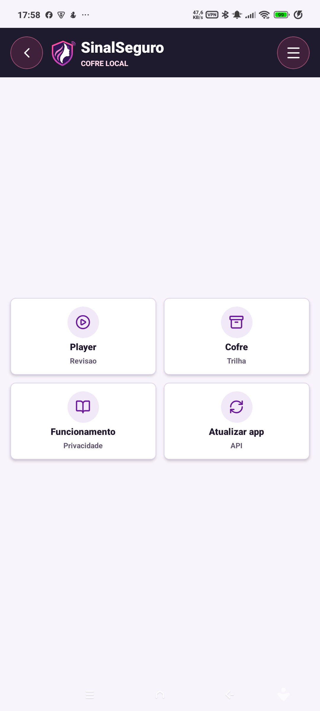 |
| SOS ativo com localizacao | 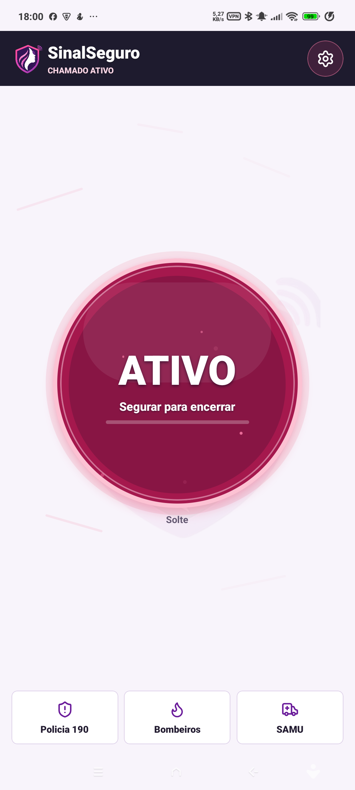 |
| Anel SOS destacado e Home atual | 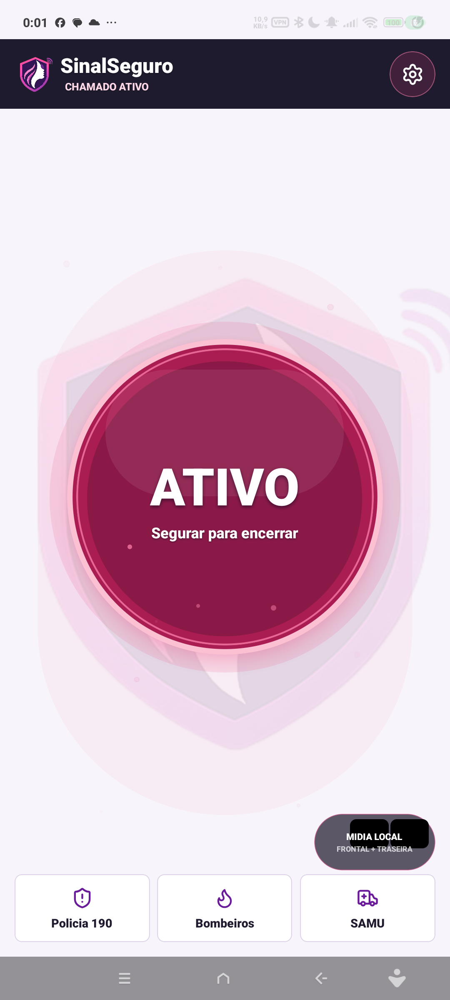 |
| Anel SOS durante pressao longa | 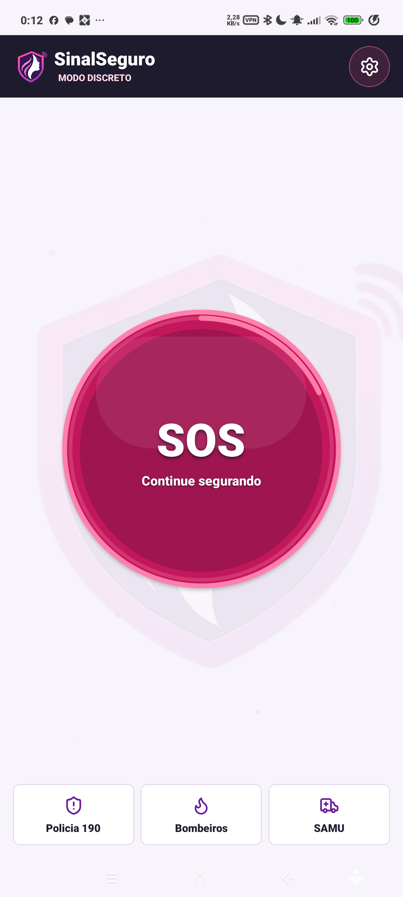 |

## Limites

- Nao versionar `.env`, tokens, chaves, credenciais, dados reais ou relatos identificaveis.
- Nao implementar gravacao oculta.
- Nao usar acessibilidade para burlar permissoes do sistema.
- Nao prometer acionamento de orgao publico sem convenio formal.
- Nao compartilhar evidencia por share sheet do sistema; convites sao a unica excecao permitida e nao carregam evidencia.
- SOS ao vivo P2P fica habilitado somente no build Android privado de homologacao, com EC2/API como plano de controle, autorizacao, sinalizacao e auditoria.
- Gravacao audiovisual local completa da chamada ao vivo ainda depende de subfase tecnica dedicada; producao publica, conveniados, exportacao e compartilhamento externo seguem bloqueados ate RIPD/DPIA, retencao, contrato, backend, RBAC, chaves e revisao juridica.

## Status Android privado - 2026-05-17

- Versao Android privada atual: `0.1.15` (`versionCode 17`).
- APK multi-ABI: `arm64-v8a` e `armeabi-v7a`.
- SHA-256: `a7b90059ce2b976c9af18ca6a43754815e423a6832aa8835305a2a99b0bb6a64`.
- Download oficial: `https://www.sinalseguro.com.br/baixar/android`.
- Nome publico do APK: `sinalseguro_android.apk`.
- SOS ao vivo Android validado em dois aparelhos: solicitante transmite, anjo autorizado recebe video/audio em tempo real, e EC2/API atua como plano de controle/sinalizacao/auditoria sem armazenar midia bruta.
- O solicitante transmite audio/video ao anjo, preserva video local cifrado da chamada no cofre e encerra a sessao remota na API; captura de audio local junto ao arquivo `.nseg` ainda fica para subfase nativa posterior.

## Documentacao

- `docs/00_PLANO_MOBILE.md`
- `docs/01_CRONOGRAMA.md`
- `docs/02_BACKLOG.md`
- `docs/03_TIMELINE.md`
- `docs/04_AGENTES.md`
- `docs/05_DESIGN_SYSTEM.md`
- `docs/06_UX_UI_IX.md`
- `docs/07_ARQUITETURA.md`
- `docs/08_SEGURANCA_LGPD.md`
- `docs/26_BUILD_PRIVADO_MIDIA_LOCAL.md`
- `docs/09_TESTES_QA.md`
- `docs/10_DISTRIBUICAO_INSTALAVEIS.md`
- `docs/11_LIFECYCLE.md`
- `docs/12_TARCILA_LOGO_README.md`
- `docs/13_ETAPA_1_ANDROID_INSTALAVEL.md`
- `docs/14_CONVITES_E_PACOTE_EMERGENCIA.md`
- `docs/15_VALIDACAO_ANDROID_RECURSOS_LOCAIS.md`
- `docs/16_SEGUNDO_PLANO_ATALHO_FISICO_E_DURACAO.md`
- `docs/17_STREAMING_COFRE_PLAYER_E_190.md`
- `docs/18_VALIDACAO_UX_SPLASH_COFRE_ANDROID.md`
- `docs/19_REFINO_SPLASH_SOS_PLAYER_BROWSER.md`
- `docs/20_HOME_SOS_FIXA_MODULAR_ANDROID_BROWSER.md`
- `docs/21_REVISAO_ESPECIALISTAS_HOME_COFRE_SEGURANCA.md`
- `docs/22_REFINO_IDENTIDADE_MODAL_COFRE_SPLASH.md`
- `docs/23_ESPECIFICACAO_DESENVOLVIMENTO_APP.md`
- `docs/24_CONTINUIDADE_COFRE_ENCERRAMENTO_QA.md`
- `docs/27_REFINO_DRAWER_COFRE_PLAYER_CONFIG.md`
- `docs/api/openapi.yaml`
