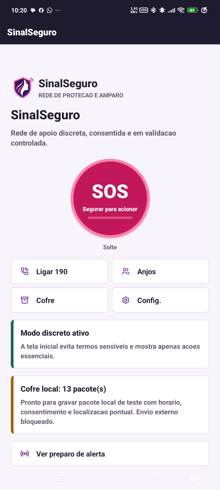
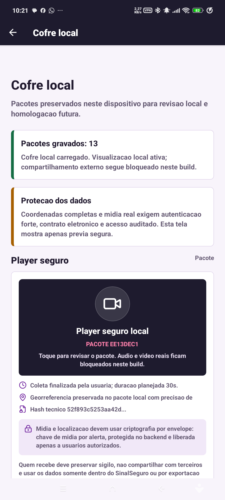
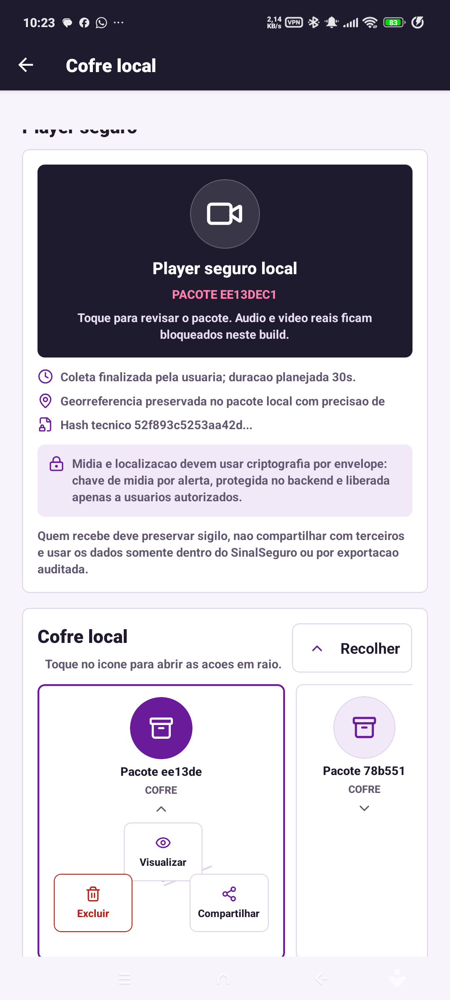
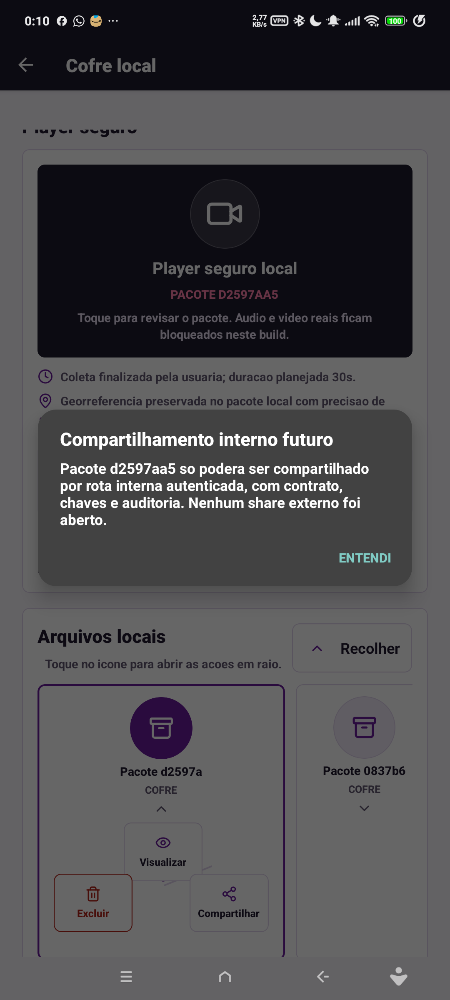

# 18 - Validacao UX: Splash, Cofre, Player e Android

Data: 2026-05-03  
Supervisao: Ze  
Gerencia mobile: Cristine  
Especialistas acionados: Tarcila, Norman, Ada, Margaret, Hedy, Schneier, Doneda, Ritchie, Myers e Knuth

## Objetivo

Concluir a correcao da inicializacao Android e entregar uma versao navegavel para validacao simulada, com foco em:

- remover o splash nativo antigo com logo horizontal;
- manter splash nativa discreta com simbolo aprovado e splash React com logo/loading;
- validar Home com botao central `SOS`;
- validar `Cofre local` com player dedicado;
- validar trilha retratil de arquivos locais;
- validar acoes em raio no icone do pacote;
- bloquear compartilhamento externo de evidencia;
- alinhar estados internos com LGPD, contrato futuro e ausencia de backend/P2P real.

## Correcoes aplicadas

### Splash

- `app.json` define a splash nativa com `./assets/brand/sinalseguro-symbol.png`.
- A splash nativa usa apenas o simbolo aprovado em fundo `#120A20`, evitando a tela roxa vazia antes do React.
- Nao ha plugin `with-android-blank-native-splash` ativo neste checkpoint.
- `app/_layout.tsx` usa `SplashScreen.preventAutoHideAsync()` apenas em Android/iOS e libera a splash nativa quando a tela React monta.
- `AppLaunchScreen` continua sendo a tela com marca completa, nome `SinalSeguro` e barra de loading.
- `colors.xml` foi alinhado para `#120A20`, evitando flash visual entre splash nativa e tela React.

Resultado: o splash antigo exibido no print enviado por Roberto foi substituido pelo simbolo discreto aprovado por Tarcila. O APK debug precisa de rebuild/reinstall para refletir ajustes nativos.

### Cofre e player

- `EvidencePlayerCard` virou area de player dedicada, com toque para selecionar visualizacao tecnica.
- `LocalEvidenceRail` organiza os pacotes como icones em trilha horizontal retratil.
- Ao tocar em um pacote, as acoes aparecem em raio: `Visualizar`, `Compartilhar` e `Excluir`; `Finalizar` aparece apenas quando houver chamado ativo.
- `Compartilhar` abre alerta interno e nao chama share sheet do Android.
- `Excluir` remove somente o pacote deste dispositivo e grava tombstone/auditoria local com `packageId`, hash anterior, motivo e data.
- A secao de gestao foi renomeada para `Cofre local`, conforme decisao Tarcila/Norman.

### Seguranca e LGPD

- Pacote finalizado fica como `recorded_local`, sem prometer fila de entrega.
- `consentSnapshot.sharing` usa `blocked_until_contract_backend_audit`.
- Contatos mock nao entram como anjos aceitos/autorizados no pacote de emergencia.
- Convite virou `pre-convite local`; aceite, revogacao e uso controlado dependem de backend.
- `buildCreateAlertDraft()` nao exporta latitude/longitude exatas neste build.
- Falhas de localizacao usam mensagem controlada, sem preservar erro bruto do sistema.
- `allowReceiverCall190` inicia `false`, pois depende de contrato bilateral e contexto legal.
- Cliente de API real fica bloqueado por flag de ambiente; sem `EXPO_PUBLIC_SINALSEGURO_API_ENABLED=1`, nao ha chamada externa acidental.
- Share sheet do sistema fica permitido apenas para pre-convite sem evidencia, midia ou localizacao.

## Evidencias visuais

Home com botao central SOS:

Cofre com player dedicado:

Arquivos locais com acoes em raio:

Compartilhamento bloqueado dentro do app:

## Validacao executada

Ambiente:

- dispositivo: Android fisico `23129RA5FL`;
- ADB Wi-Fi: `192.168.0.5:5555`;
- pacote: `br.com.sinalseguro.app`;
- APK debug: `android/app/build/outputs/apk/debug/app-debug.apk`;
- SHA-256 do APK debug: `2e9fcbdc8b214f3f2f73c636263866f22b02ffdaa037e369ec7b8c5995f21748`;
- Metro: `packager-status:running` em `127.0.0.1:8081`.

Comandos/gates:

- `npm run typecheck`: aprovado;
- `npm run lint`: aprovado;
- `npm test`: aprovado;
- `./gradlew :app:assembleDebug --console=plain`: aprovado;
- `adb install -r android/app/build/outputs/apk/debug/app-debug.apk`: `Success`;
- `npm run release:android:readiness`: pronto para build condicionado, com pendencias esperadas de assinatura e nativo gerado;
- busca por termos proibidos operacionais: sem ocorrencias;
- log/UI limpos para `rn_redbox`, `Unable to load script`, `RedBox` e erro de keep awake na evidencia limpa;
- log filtrado do processo do app sem `FATAL`, `AndroidRuntime`, `RedBox`, upload `/alerts`/`/media`, `webrtc`, `CAMERA`, `RECORD_AUDIO` ou `ACCESS_BACKGROUND_LOCATION`;
- crash buffer final: sem crash do app;
- Navegador aberto em `http://127.0.0.1:8081` com titulo `SinalSeguro`, mas preview web ficou preto no dev-client; validacao visual oficial desta etapa permanece no Android fisico.

Fluxos validados:

- abertura do app com Metro ativo;
- ausencia do splash nativo antigo com logo horizontal no APK reconstruido;
- Home com `SOS`, `Ligar 190`, `Anjos`, `Cofre` e `Config.`;
- microcopy do botao SOS ajustado para `Solte`, sem truncamento;
- `Cofre local` com player dedicado e metadados resumidos;
- trilha retratil de arquivos locais;
- acoes em raio ligadas ao pacote selecionado;
- compartilhamento de evidencia permanece bloqueado, sem abrir share sheet externo.

## Limites ainda ativos

- O APK debug/dev-client depende do Metro. Sem Metro, pode aparecer RedBox de bundle ausente; isso nao e travamento de splash.
- Para validacao sem Metro, gerar build preview/release com bundle JS embarcado.
- Audio, video, streaming, backend, P2P e exportacao real continuam bloqueados ate contrato, backend, chaves, auditoria, retencao, RIPD/DPIA e revisao juridica.
- O player ainda e visual/tecnico; reproducao real de midia entra apenas na homologacao controlada.

## Aceite desta etapa

Status: pronto para validacao simulada de Roberto no Android conectado, com ressalva de que o build atual e debug e depende do Metro.
