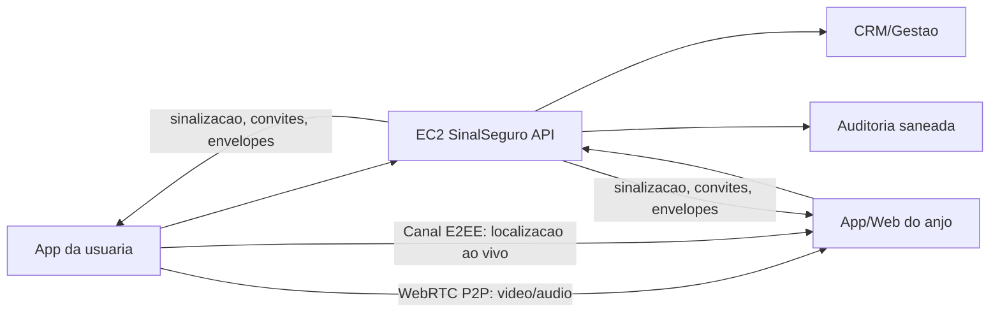

# 32 - Plano de Login, Videochamada, Anjos e Localizacao ao Vivo

Data: 2026-05-05
Coordenacao: Ze e Cristine
Especialistas: Ada, Ritchie, Kim, Brenda/Berners, Norman, Tarcila, Schneier, Doneda e Myers

## Objetivo

Preparar a evolucao do app para login real, videochamada de emergencia com anjo autorizado, localizacao em tempo real e compartilhamento de chaves, usando a EC2 do SinalSeguro como coordenador isolado. O desenho deve funcionar para cliente-servidor-cliente e para P2P, sem prometer integracao oficial com orgaos publicos e sem expor midia, audio ou localizacao em claro no servidor.

## Estado atual

- App mobile ja possui cliente API POO em `src/services/apiClient.ts`.
- Login por e-mail e Google OIDC estao preparados na tela `Configuracoes > Login`.
- Google OIDC depende do client OAuth Android real no ambiente do app e de `GOOGLE_OIDC_CLIENT_IDS` no backend.
- EC2 do SinalSeguro esta preparada como API/CRM isolada em `https://api.sinalseguro.com.br/api` e `https://gestao.sinalseguro.com.br`.
- Midia local ja tem arquitetura de chunks criptografados em `docs/30_MIDIA_CRIPTOGRAFADA_CHUNKS.md`.
- Compartilhamento remoto seguro ja tem desenho base em `docs/31_ARQUITETURA_COMPARTILHAMENTO_TEMPO_REAL.md`.

## Checkpoint F0 - 2026-05-05

- Google Auth Platform foi criada no projeto Google Cloud `sinalseguro`.
- Branding OAuth usa nome `SinalSeguro`, suporte e contato operacional da conta SinalSeguro.
- Publico esta como `Externo` e status `Testando`.
- Client OAuth Android `SinalSeguro Android privado` foi criado para package `br.com.sinalseguro.app` e SHA-1 do APK privado atual.
- Conta SinalSeguro foi adicionada como usuaria de teste.
- Client ID real ficou somente no Keychain local, em `.env.local` ignorado pelo Git e em `/etc/sinalseguro-api.env` na EC2.
- JSON baixado pelo console foi removido de `Downloads`.
- EC2 foi reiniciada e validada com health/readiness, `nginx -t`, `sinalseguro-api`, `cereusia-crm` e hash de `cereusia.conf`.
- O valor real do client ID nao foi registrado em Git, docs ou memoria.

## Principios obrigatorios

- Desenvolvimento, testes e operacao inicial devem permanecer em niveis gratuitos sempre que tecnicamente viavel.
- Nenhum billing pago, TURN pago, servico gerenciado pago ou upgrade de Google Cloud/AWS/Cloudflare deve ser ativado sem aprovacao explicita, estimativa de custo, limite de gasto e registro em memoria.
- Login e identidade nao podem depender de conta do navegador local do operador.
- Cada anjo deve ter conta propria, aceite expresso, dispositivo proprio e chave publica propria.
- Video, audio e localizacao ao vivo so podem ser compartilhados enquanto a emergencia estiver ativa.
- O servidor pode autenticar, autorizar, auditar, sinalizar e distribuir envelopes de chave, mas nao deve precisar descriptografar midia, audio ou localizacao.
- Conveniados entram em fase futura separada, com contrato, RBAC, MFA, retencao, auditoria, base juridica e RIPD/DPIA.
- Convites de anjos sao recurso restrito a contas adultas verificadas.
- Menores de idade podem existir como perfis/dependentes vinculados a responsavel legal verificado, mas nao podem convidar anjos, conveniados ou terceiros.
- Responsaveis podem adicionar filhos/dependentes e configurar a propria conta como anjo/responsavel do menor, com consentimento versionado, trilha de auditoria e revisao ECA Digital/LGPD.
- O modelo de menores deve considerar o risco de o agressor ser responsavel legal; nenhum compartilhamento automatico de midia, localizacao ou historico sensivel deve ocorrer sem regra de seguranca aprovada.

## Arquitetura alvo

## Fases de implementacao

### Fase 0 - OIDC e base de identidade

- Criar branding Google Auth Platform do projeto `sinalseguro`.
- Criar OAuth client Android para `br.com.sinalseguro.app` e SHA-1 do APK privado atual.
- Guardar client ID apenas em ambiente seguro do app e backend; nenhum valor real entra em Git ou memoria.
- Configurar `GOOGLE_OIDC_CLIENT_IDS` na EC2 e reiniciar `sinalseguro-api`.
- Validar `Entrar com Google` no Android e `POST /api/auth/google` no backend.

Pronto quando:

- login Google gera JWT interno do SinalSeguro;
- sessao fica em `expo-secure-store`;
- logout revoga refresh token;
- `nginx -t`, `sinalseguro-api`, `cereusia-crm` e hash de `cereusia.conf` continuam aprovados.

### Fase 1 - Contas, dispositivos e chaves

- Registrar dispositivo autenticado no endpoint `/devices/`.
- Gerar par de chaves do dispositivo no app.
- Enviar apenas chave publica e hash para o backend.
- Permitir revogacao de dispositivo e rotacao de chave.
- Registrar consentimentos versionados para login, emergencia, midia, localizacao e anjos.
- Classificar conta como `adulto`, `responsavel` ou `menor_dependente`, sem confiar apenas em texto livre informado pelo usuario.

Pronto quando:

- cada sessao autenticada tem dispositivo conhecido;
- chave privada nunca sai do aparelho;
- logs nao contem token, IP em claro, user-agent em claro, coordenada ou payload sensivel.

### Fase 1.1 - Responsaveis, filhos e maioridade

- Criar modelo minimo de vinculo `responsavel_dependente`, com responsavel adulto verificado e filho/dependente menor.
- Permitir que responsaveis adicionem filhos/dependentes e gerenciem destinatarios de emergencia do menor.
- Bloquear no app e na API qualquer convite de anjo iniciado por conta menor.
- Tratar pais/responsaveis como anjos padrao do menor somente apos aceite, dispositivo registrado e chave publica valida.
- Registrar consentimento versionado do responsavel e aviso de finalidade para emergencia, localizacao, video/audio e armazenamento.
- Aplicar minimizacao: o perfil do menor deve coletar apenas o necessario para identificacao, seguranca e acionamento.
- Adiar chat, rede social, videochamada livre ou compartilhamento amplo envolvendo menor ate politica de moderacao, denuncia, bloqueio, idade e revisao juridica.

Pronto quando:

- API nega convite criado por menor mesmo que o app falhe;
- responsavel consegue vincular dependente sem expor dados sensiveis em logs;
- o menor consegue acionar emergencia para responsaveis autorizados;
- Doneda/Schneier aprovam matriz de dados, risco de responsavel agressor, consentimento e retencao.

### Fase 2 - Anjos e convites

- Criar convite opaco, expiravel e de uso unico.
- Anjo aceita convite com conta propria.
- Convite so pode ser criado por conta adulta/responsavel autorizada; conta menor nao pode convidar.
- Anjo registra dispositivo e chave publica.
- Usuaria adulta ou responsavel pode revogar, pausar ou bloquear anjo.
- API retorna apenas anjos autorizados e com chave valida para emergencia.

Pronto quando:

- nao existe compartilhamento para contato mock ou anjo pendente;
- aceite, revogacao e bloqueio ficam auditados;
- UI deixa claro quem recebera emergencia antes de ativar compartilhamento real.

### Fase 3 - Emergencia remota idempotente

- App cria `/emergency-sessions/` com `client_alert_id` e `idempotency_key`.
- API responde de forma idempotente em repeticoes.
- App monta plano de destinatarios autorizados.
- App cria chave efemera de sessao e envelopes por anjo.
- API guarda somente envelope criptografado, metadados minimos e auditoria saneada.

Pronto quando:

- emergencia funciona offline/local se API falhar;
- reenvio nao duplica sessao;
- sem midia real no servidor nesta fase.

### Fase 4 - Sinalizacao e videochamada P2P

- Definir adaptador WebRTC para Android/iOS.
- Usar API apenas para troca de offer, answer, ICE candidates e eventos de controle.
- Usar TURN apenas como fallback tecnico futuro, com risco e custo avaliados.
- Manter DTLS-SRTP do WebRTC e envelope de chaves para dados auxiliares.
- Encerrar canais quando a emergencia for encerrada.

Pronto quando:

- pause/resume/replay de UI nao recria sessoes indevidas;
- app recupera falha de candidato ICE;
- chamadas encerram ao revogar anjo, sair da conta ou finalizar emergencia;
- Myers valida tempo ate primeiro frame, memoria, CPU e reconexao.

### Fase 5 - Localizacao em tempo real

- Coletar localizacao somente durante emergencia ativa e com permissao em contexto.
- Aplicar intervalo adaptativo para bateria e seguranca.
- Enviar localizacao em canal criptografado para anjos autorizados.
- Parar coleta imediatamente ao encerrar emergencia ou revogar permissao.
- Nunca registrar coordenada em logs; guardar somente metadado minimo de status quando necessario.

Pronto quando:

- app mostra estado claro de compartilhamento ativo;
- background location so entra se houver justificativa, disclosure e politica aprovadas;
- Google Play Data Safety e Apple Privacy Details refletem exatamente o comportamento.

### Fase 6 - CRM e area admin

- CRM deve separar gestao operacional de dados sensiveis.
- Modulos iniciais:
  - usuarios e dispositivos;
  - responsaveis, filhos/dependentes e politica de maioridade;
  - anjos, convites e consentimentos;
  - sessoes de emergencia com status saneado;
  - auditoria;
  - configuracoes do hub de login;
  - politicas e versoes de termos;
  - fila de revisao tecnica e juridica.
- Norman/Tarcila revisam fluxo visual antes de qualquer publicacao.
- Schneier/Doneda definem mascaramento, acesso por papel e retencao.

Pronto quando:

- admin exige staff, papel adequado e MFA na fase de producao;
- auditoria nao exibe segredo nem dado bruto;
- conveniados continuam fora ate contrato e permissao propria.

### Fase 7 - Loja, leis e release

- Atualizar politica de privacidade, termos, matriz LGPD, RIPD/DPIA e retencao.
- Declarar camera, microfone, localizacao, identificadores, conta, contatos e dados sensiveis nas lojas.
- Criar fluxo de exclusao de conta e exportacao quando aplicavel.
- Ativar perfis de menores somente com politica ECA Digital/LGPD especifica, responsavel verificado, consentimento adequado, minimizacao e controles contra abuso.
- Validar Apple Sign-In se houver outro login social no iOS publico.

Pronto quando:

- Google Play Data Safety e Apple Privacy Details batem com codigo e backend;
- consentimentos sao versionados;
- release publica nao usa permissoes ou coleta sem finalidade ativa.

## Sequencia sem retrabalho apos interrupcao

1. Ler `AGENTS.md`, `.codex/memory/CRISTINE.md`, `docs/03_TIMELINE.md`, este documento e `docs/31_ARQUITETURA_COMPARTILHAMENTO_TEMPO_REAL.md`.
2. Rodar `git status --short --branch`.
3. Confirmar se o client ID Google real ja existe em ambiente seguro, sem imprimir o valor.
4. Validar API com `Testar API` no app ou por health check.
5. Avancar apenas no proximo bloco incompleto da fase atual.
6. Antes de build, deploy ou configuracao externa, registrar checkpoint em memoria e docs.

## Lacunas tecnicas que bloqueiam midia real

Antes de ativar video/audio/localizacao reais para anjos, fechar estes contratos:

- OpenAPI unico para `auth`, `devices`, `trusted_contacts`, `recipient_public_keys`, `emergency_sessions`, `key_envelopes`, `p2p_signaling`, `location_stream` e `audit`.
- OpenAPI e modelo de dominio para `guardians`, `dependents`, `age_assurance`, `guardian_consents` e bloqueio server-side de convites por menores.
- Modelo de chaves por dispositivo: geracao local, armazenamento seguro, chave publica, assinatura ou verificacao, rotacao, revogacao e perda de aparelho.
- Envelope de chave: algoritmo, AAD, versao de esquema, destinatarios multiplos, reenvio, revogacao e acesso apos encerramento.
- WebRTC: STUN/TURN, politica de relay, autenticacao da sinalizacao, expiracao de offer/answer/ICE, mitigacao de spam e fallback.
- Localizacao ao vivo: frequencia, precisao, pausa, encerramento, buffer offline, retencao e descriptografia pelo anjo sem servidor ver claro.
- Outbox remota mobile: fila idempotente para login, dispositivo, convites, emergencia, envelopes, sinalizacao e localizacao com rede oscilante.
- RBAC desde o banco/API: usuaria, anjo, admin, auditor e conveniado futuro.
- Retencao por tipo de dado: midia cifrada local, envelopes, localizacao, metadados, logs de sinalizacao, auditoria e tombstones.
- Threat model formal: agressor com acesso fisico ao aparelho, anjo malicioso, token roubado, replay de convite, troca de chave, enumeracao de usuarios e vazamento de localizacao.

Prioridade pratica: concluir `OIDC + devices + chaves publicas + anjos + envelopes + emergency_sessions` antes de midia real, localizacao continua ou P2P critico.

## Gates de compliance e loja

- LGPD: matriz de dados, bases legais, controlador/operador, encarregado/canal, finalidades, retencao, descarte, compartilhamentos, RIPD/DPIA, direitos do titular e logs saneados.
- ECA Digital / Lei 15.211/2025: classificar acesso provavel por criancas/adolescentes, definir politica de idade, permitir responsaveis adicionarem filhos/dependentes, bloquear convites iniciados por menores, evitar supervisao parental generica quando o responsavel puder ser agressor, e bloquear chat/video/rede social sem moderacao, denuncia e bloqueio.
- Google Play: Data Safety consistente com SDKs/backend, politica de privacidade ativa, prominent disclosure para camera/microfone/localizacao, account deletion e formulario/video para background location se existir.
- Apple: App Privacy Details, exclusao de conta no app, Sign in with Apple quando exigido por login social, push sem dado sensivel, suporte/moderacao para comunicacao entre usuarios.
- Videochamada: somente homologacao controlada ate consentimento especifico, indicador visivel de camera/microfone, retencao definida, auditoria e RIPD.
- Localizacao em tempo real: nao entra direto no MVP publico; comecar por localizacao pontual consentida e evoluir para tempo real apenas com disclosure, revogacao e revisao de loja.

## Fontes normativas para revisao

- Google OAuth 2.0 Policies: `https://developers.google.com/identity/protocols/oauth2/policies`
- Google Play User Data: `https://support.google.com/googleplay/android-developer/answer/10144311`
- Google Play Data Safety: `https://support.google.com/googleplay/android-developer/answer/10787469`
- Apple App Privacy Details: `https://developer.apple.com/app-store/app-privacy-details/`
- Apple App Review Guidelines: `https://developer.apple.com/app-store/review/guidelines/`
- LGPD: `https://www.planalto.gov.br/ccivil_03/_ato2015-2018/2018/lei/l13709compilado.htm`
- ECA Digital: `https://www.planalto.gov.br/ccivil_03/_ato2023-2026/2025/lei/l15211.htm`
